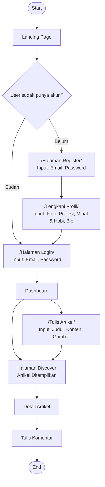

# 📄 Product Requirements Document (PRD)
# **Nulisin** — Platform Penerbitan Daring (*Online Publishing Platform*)

---

| Item | Detail |
|---|---|
| **Nama Proyek** | Nulisin |
| **Mata Kuliah** | Pemrograman Mobile — ITG 2026 |
| **Jenis Tugas** | Tugas Akhir (Kelompok, 2–3 orang) |
| **Target Selesai** | 4 Minggu (Minimum Viable Product) |
| **Tanggal Dokumen** | 5 Juni 2026 |
| **Versi** | 2.0 (Revisi — Konsep Medium-Like) |

---

## 1. Latar Belakang & Tujuan

### 1.1 Latar Belakang

Terinspirasi dari **Blogspot (Blogger)**, Nulisin adalah **platform penerbitan daring** (*online publishing platform*) berbasis web yang memungkinkan siapa saja untuk menulis dan membaca artikel secara bebas. Nulisin bukan platform berita aktual — melainkan tempat setiap orang bisa menuangkan pemikiran, opini, esai, tutorial, dan cerita pengalaman secara terstruktur.

### 1.2 Inspirasi: Apa itu Blogspot (Blogger)?

**Blogspot (Blogger)** adalah platform blogging gratis milik Google yang menjadi inspirasi utama Nulisin. Blogspot memungkinkan siapa saja membuat blog pribadi dan mempublikasikan tulisan ke internet tanpa biaya dan tanpa keahlian teknis. Berikut karakteristik Blogspot yang diadopsi:

| Aspek | Karakteristik Blogspot | Adopsi di Nulisin |
|---|---|---|
| **Jenis Konten** | Blog pribadi, opini, diary, review, tutorial, cerita pengalaman | ✅ Sama — opini, esai, tutorial, cerita |
| **Siapa yang Menulis** | Pemilik blog (siapa saja bisa mendaftar gratis) | ✅ Semua user yang terdaftar bisa menulis |
| **Gratis & Mudah** | Tidak perlu hosting, domain, atau setup teknis | ✅ Cukup daftar akun dan langsung menulis |
| **Komentar** | Kolom komentar di bawah setiap postingan | ✅ Komentar satu arah, kronologis |
| **Kategori/Label** | Sistem label untuk mengelompokkan postingan | ✅ Kategori/topik pre-defined |
| **Kustomisasi Template** | Template HTML/CSS yang bisa diubah total | ❌ Desain tetap (editorial minimalis) |
| **Google Adsense** | Monetisasi melalui iklan | ❌ Tidak termasuk scope MVP |

### 1.3 Posisi Nulisin

```
┌──────────────────────────────────────────────────────────┐
│                    SPEKTRUM PLATFORM                     │
│                                                          │
│  Berita Aktual          Platform Blog        Blog Pribadi│
│  (Detik, Kompas)        (Blogspot, WordPress) (Tumblr)   │
│       ╳                    ◉ Nulisin              ◉      │
│  BUKAN INI             ← INI POSISINYA →     Inspirasi   │
│                                                          │
└──────────────────────────────────────────────────────────┘
```

### 1.4 Tujuan Proyek
- Membangun **platform penerbitan daring** sederhana berbasis web menggunakan **Flutter Web**.
- Mengimplementasikan **Supabase** sebagai Backend-as-a-Service (BaaS) untuk autentikasi, database, dan penyimpanan file.
- Menghasilkan MVP yang fungsional dengan **4 fitur inti** dalam waktu 4 minggu.
- Memberikan pengalaman menulis dan membaca yang **nyaman, minimalis, dan fokus** — mengambil kemudahan Blogspot dengan desain yang lebih modern.

### 1.5 Konsep Produk

> *"Tempat pikiran yang ingin tahu menemukan pemahaman mendalam."*

**Nulisin** — dari kata *"nulis"* (menulis) — adalah platform editorial minimalis yang mengutamakan **kenyamanan membaca** (*reading comfort*) dan **kemudahan menulis** (*writing simplicity*). Nama ini mencerminkan misi utama platform: **membuat siapa saja bisa nulis dan berbagi pemikiran**. Desainnya terinspirasi dari estetika editorial modern — bersih, tenang, dan profesional — dengan palet warna hijau hutan (*Forest Depth*) yang melambangkan stabilitas, pertumbuhan, dan konten yang selalu relevan (*evergreen content*).

**Jenis tulisan yang bisa dipublikasikan di Nulisin:**
- 📝 **Artikel Opini** — Sudut pandang dan pemikiran penulis
- 📖 **Esai & Analisis Mendalam** — Pembahasan topik secara menyeluruh
- 📚 **Cerita Pengalaman Pribadi** — *Personal essays* dan refleksi
- 💡 **Tutorial & Panduan** — Cara melakukan sesuatu, terutama teknologi
- 🌱 **Tips Pengembangan Diri** — Produktivitas, karier, dan pertumbuhan personal

---

## 2. Tech Stack

| Layer | Teknologi | Keterangan |
|---|---|---|
| **Frontend** | Flutter (Dart) | Framework UI untuk web application |
| **Backend** | Supabase | BaaS (PostgreSQL, Auth, Storage, Realtime) |
| **Database** | PostgreSQL (via Supabase) | Relational database |
| **Autentikasi** | Supabase Auth | Email & password |
| **File Storage** | Supabase Storage | Penyimpanan gambar artikel & avatar |
| **Design Tool** | Figma | Mockup UI/UX |
| **State Management** | Provider / Riverpod | (Dipilih saat implementasi) |

---

## 3. User Persona & Role

### 3.1 Peran Pengguna

Nulisin menerapkan **single-role system** — setiap pengguna yang mendaftar otomatis menjadi **Penulis**. Tidak ada pemisahan antara penulis dan pembaca.

| Role | Deskripsi | Hak Akses |
|---|---|---|
| **Penulis** *(Writer)* | Setiap user terdaftar — bisa menulis sekaligus membaca | Menulis, mengedit, menghapus tulisan sendiri; membaca semua artikel; menulis komentar |

> [!NOTE]
> Pada Blogspot, pemilik blog adalah satu-satunya penulis. Di Nulisin, konsepnya diperluas menjadi **multi-author platform** — siapa saja yang mendaftar langsung bisa menulis dan mempublikasikan tulisan, tanpa perlu memilih role.


---

## 4. Daftar Fitur Inti (Core Features)

### Fitur 1: Autentikasi Akun (Sign Up & Login)

| Aspek | Detail |
|---|---|
| **Deskripsi** | Sistem pendaftaran dan login menggunakan email & password. Setiap user yang mendaftar otomatis menjadi Penulis. |
| **Alur Registrasi** | Email + Password → Lengkapi Profil (Foto, Profesi, Minat & Hobi, Bio) → Dashboard |
| **Alur Login** | Email + Password → Dashboard |
| **Validasi** | Email format valid, password min. 6 karakter |
| **Session** | Persistent login menggunakan Supabase Auth token |

**Acceptance Criteria:**
- [x] User dapat mendaftar dengan email & password
- [x] User otomatis menjadi Penulis setelah registrasi (tanpa pilih role)
- [x] User dapat melengkapi profil setelah registrasi
- [x] User dapat login kembali dengan kredensial yang sudah terdaftar
- [x] Session tersimpan (tidak perlu login ulang setiap buka app)
- [x] Error handling: email sudah terdaftar, password salah, format email invalid

---

### Fitur 2: Manajemen Konten Tulisan (CRUD Artikel)

| Aspek | Detail |
|---|---|
| **Deskripsi** | Fasilitas bagi setiap user untuk mengelola tulisan/artikel yang dipublikasikan |
| **Create** | Menulis tulisan baru — Input: Judul, Konten (teks), Gambar Sampul, Kategori/Topik |
| **Read** | Melihat daftar semua tulisan milik sendiri di dashboard (*Your Stories*) |
| **Update** | Menyunting judul, konten, gambar, atau kategori tulisan yang sudah ada |
| **Delete** | Menghapus tulisan beserta seluruh komentar terkait |
| **Upload Gambar** | Satu gambar sampul (*cover image*) per artikel, disimpan di Supabase Storage |

> [!NOTE]
> Konten tulisan berupa **teks dan satu gambar sampul**. Belum mendukung *rich text editor*, penyisipan gambar di tengah teks, atau format Markdown. Konten disimpan sebagai *plain text*.

**Acceptance Criteria:**
- [x] User dapat membuat tulisan baru dengan judul, konten teks, dan gambar sampul
- [x] User dapat melihat daftar semua tulisan miliknya (*Your Stories*)
- [x] User dapat menyunting tulisan yang sudah dipublikasikan
- [x] User dapat menghapus tulisan (beserta komentarnya)
- [x] Gambar di-upload ke Supabase Storage dan URL disimpan di database

---

### Fitur 3: Halaman Beranda Publik (Discover Feed & Detail Artikel)

| Aspek | Detail |
|---|---|
| **Deskripsi** | Tampilan utama untuk menjelajahi tulisan dari seluruh penulis dan membaca konten lengkap |
| **Feed (Discover)** | Menampilkan daftar tulisan dari semua penulis, diurutkan berdasarkan waktu terbaru |
| **Detail Artikel** | Halaman khusus untuk membaca isi lengkap tulisan dengan layout editorial yang nyaman |
| **Informasi** | Judul, gambar sampul, nama penulis, avatar penulis, tanggal publikasi, konten lengkap, kolom komentar |
| **Jelajahi Topik** | Filter tulisan berdasarkan topik/kategori (Teknologi, Opini, Gaya Hidup, dll.) |

**Acceptance Criteria:**
- [x] Semua user dapat melihat *discover feed* tulisan terbaru
- [x] User dapat membuka detail tulisan untuk membaca konten lengkap
- [x] Detail tulisan menampilkan: judul, gambar, nama & avatar penulis, tanggal, konten
- [x] Feed menampilkan tulisan secara kronologis (terbaru di atas)
- [x] User dapat menjelajahi tulisan berdasarkan topik/kategori

---

### Fitur 4: Kolom Respons Pembaca (Komentar Berbasis Login)

| Aspek | Detail |
|---|---|
| **Deskripsi** | Kolom interaksi di bawah setiap tulisan — ruang bagi pembaca untuk merespons dan berdiskusi |
| **Prasyarat** | User **harus login** untuk mengirim komentar (mendorong akuntabilitas) |
| **Format** | Komentar teks satu arah, kronologis (terbaru di bawah) |
| **Informasi** | Nama pengguna, avatar, waktu komentar, isi komentar |
| **Batasan** | Tidak ada *nested reply*, tidak ada like/upvote pada komentar |

**Acceptance Criteria:**
- [x] User yang sudah login dapat menulis komentar di tulisan manapun
- [x] User yang belum login melihat prompt untuk login/register terlebih dahulu
- [x] Komentar ditampilkan kronologis dengan informasi pengguna (nama, avatar, waktu)
- [x] Komentar tidak bisa diedit atau dihapus oleh penulisnya (batasan MVP)
- [x] Penulis tulisan tidak mendapat notifikasi komentar baru (sesuai scope)

---

## 5. Batasan Ruang Lingkup (Scope Boundaries)

> [!IMPORTANT]
> Fitur-fitur berikut **TIDAK termasuk** dalam scope MVP dan **TIDAK akan diimplementasikan** pada versi pertama:

| Kategori | Yang TIDAK Termasuk | Keterangan |
|---|---|---|
| **Autentikasi** | Login pihak ketiga (Google, Facebook, Apple) | Hanya email & password |
| **Media & Format** | Upload video, dokumen, *multiple images*, *rich text editor* | Hanya teks + 1 gambar sampul |
| **Sistem Apresiasi** | *Like*, *upvote*, tombol suka | Belum ada sistem apresiasi |
| **Komentar** | *Nested reply*, edit/delete komentar | Komentar satu arah, kronologis |
| **Notifikasi** | Push notification, email notification | Tidak ada notifikasi |
| **Sosial** | Follow penulis, *bookmark* artikel, *reading list* | Belum ada fitur sosial |
| **Monetisasi** | Iklan (Google Adsense), sistem langganan | Tidak ada monetisasi |
| **Pencarian** | Full-text search | Gunakan filter kategori saja |
| **Moderasi** | Admin panel, *content moderation*, *report* | Tidak ada moderasi konten |
| **Kustomisasi** | Template/tema yang bisa diubah pengguna | Desain tetap (editorial minimalis) |
| **Platform** | Build APK/IPA native, Aplikasi Desktop | Hanya fokus pada platform Web |

---

## 6. User Flow

Berikut alur utama aplikasi berdasarkan flowchart yang sudah dibuat:



### 6.1 Detail Alur Per Halaman

| No | Halaman | Fungsi | Komponen Utama |
|---|---|---|---|
| 1 | **Landing Page** | Halaman sambutan — "*Tempat pikiran yang ingin tahu menemukan pemahaman mendalam*" | Hero section, CTA Login/Register, preview fitur |
| 2 | **Register** | Pendaftaran akun baru | Form email, password |
| 3 | **Lengkapi Profil** | Mengisi data profil pengguna | Upload foto, input profesi, minat & hobi, bio |
| 4 | **Login** | Masuk ke akun yang sudah terdaftar | Form email, password |
| 5 | **Dashboard / Beranda** | Halaman utama setelah login — "*Halo, [Nama]*" | Greeting personal, daftar tulisan terbaru |
| 6 | **Discover (Feed)** | Jelajahi semua tulisan dari seluruh penulis | Grid/list tulisan, filter berdasarkan topik |
| 7 | **Tulis Artikel** | Form pembuatan tulisan baru (semua user) | Input judul, editor konten, upload gambar sampul |
| 8 | **Detail Artikel** | Baca tulisan lengkap dengan layout editorial | Konten tulisan, info penulis, kolom komentar |
| 9 | **Jelajahi Topik** | Filter tulisan berdasarkan kategori | Daftar topik/kategori dengan *thumbnail* |
| 10 | **Edit Profil** | Ubah data profil pengguna | Form edit foto, nama, profesi, bio |

---

## 7. Desain UI/UX

### 7.1 Design System — "Modern Editorial System"

Sistem desain dibangun untuk lingkungan penerbitan kontemporer yang menyeimbangkan **otoritas jurnalisme tradisional** dengan **aksesibilitas platform sosial modern**.

| Elemen | Spesifikasi |
|---|---|
| **Palet Warna Utama** | Primary: `#064E3B` (Forest Green), Secondary: `#10B981`, Tertiary: `#F0FDF4` (Mint Tint) |
| **Background** | Pure White `#FFFFFF` atau Soft Gray `#F9FAFB` — kesan *airy* dan bersih |
| **Border** | Subtle `#E5E7EB` — menghindari *visual clutter* |
| **Font Konten** | **Newsreader** (Serif) — suara penulis; untuk headline, body tulisan, quote |
| **Font UI** | **Inter** (Sans-Serif) — mesin fungsional; untuk navigasi, button, metadata, form |
| **Border Radius** | Komponen kecil (button, input): `8px` / Card, container: `16px` / Chip: `full rounded` |
| **Spacing** | Baseline grid `8px`, Gutter `24px`, Margin mobile `16px`, Margin desktop `64px` |
| **Kolom Baca** | Max `720px` — *sweet spot* untuk 60-75 karakter per baris |
| **Container Max** | `1200px` untuk *browse views* (grid kartu) |
| **Elevasi** | Minimal — *ambient shadows* (4-8% opacity), *tonal layering* dengan Tertiary green |

### 7.2 Prinsip Desain

1. **Minimalis & Editorial** — Fokus pada konten, *whitespace* yang lega, menghilangkan ornamen yang tidak perlu. Desain harus menempatkan tulisan sebagai bintang utama.
2. **Calm & Sophisticated** — Palet hijau hutan yang menenangkan, membangkitkan kesan *intellectual rigor* dan komunitas yang bijaksana.
3. **Dual-Font Strategy** — **Newsreader** untuk konten (karena memberikan *feel* sastra dan sofistikasi), **Inter** untuk UI (karena netral dan tidak mengganggu).
4. **Reading Comfort** — Kolom baca max 720px, *line-height* yang generous (32px untuk *body-lg*), jarak antar paragraf 32-48px.
5. **Mobile-First** — Dioptimalkan untuk layar kecil, lalu *scale up* ke tablet dan desktop.

### 7.3 Halaman Mockup

Mockup telah dibuat di Figma, mencakup halaman-halaman berikut:

| Halaman | Status | Catatan |
|---|---|---|
| Landing Page | ✅ Selesai | Versi desktop & mobile |
| Register | ✅ Selesai | — |
| Lengkapi Profil | ✅ Selesai | — |
| Login | ✅ Selesai | — |
| Dashboard / Feed | ✅ Selesai | — |
| Detail Artikel | ✅ Selesai | — |
| Tulis Artikel | ✅ Selesai | — |
| Jelajahi Topik | ✅ Selesai | — |
| Edit Profil | ✅ Selesai | — |

### 7.4 Komponen UI Utama

| Komponen | Spesifikasi |
|---|---|
| **Button Primary** | Solid Forest Green `#064E3B`, teks putih Inter, tanpa shadow |
| **Button Secondary** | Transparan + border 1px Forest Green |
| **Article Card** | Radius 16px, border 1px gray, *ambient shadow* on hover; headline pakai Newsreader |
| **Input Field** | Radius 8px, background putih, border 1px; *focus state*: border hijau + *soft glow* |
| **Chips/Tags** | Pill-shaped (full rounded), background Tertiary `#F0FDF4`, teks Primary green |
| **Navigation** | Inter Medium, *active state*: underline hijau 2px atau *weight shift* |

---

## 8. Desain Struktur Data (Database Schema — Supabase)

### 8.1 Entity Relationship Diagram (ERD)

```mermaid
erDiagram
    AUTH_USERS ||--|| PROFILES : "1:1"
    PROFILES ||--o{ ARTICLES : "writes"
    PROFILES ||--o{ COMMENTS : "posts"
    ARTICLES ||--o{ COMMENTS : "has"
    ARTICLES }o--o{ CATEGORIES : "belongs to"
    ARTICLES }o--o{ CATEGORIES : "via article_categories"

    AUTH_USERS {
        uuid id PK
        string email
        string encrypted_password
        timestamp created_at
    }

    PROFILES {
        uuid id PK "FK → auth.users.id"
        text full_name
        text avatar_url
        text profession
        text interests
        text bio
        enum role "writer | reader"
        timestamp created_at
        timestamp updated_at
    }

    ARTICLES {
        uuid id PK
        uuid author_id FK "→ profiles.id"
        text title
        text content
        text cover_image_url
        boolean is_published
        timestamp published_at
        timestamp created_at
        timestamp updated_at
    }

    CATEGORIES {
        uuid id PK
        text name "UNIQUE"
        text description
        text cover_image_url
        timestamp created_at
    }

    ARTICLE_CATEGORIES {
        uuid article_id PK_FK "→ articles.id"
        uuid category_id PK_FK "→ categories.id"
    }

    COMMENTS {
        uuid id PK
        uuid article_id FK "→ articles.id"
        uuid user_id FK "→ profiles.id"
        text content
        timestamp created_at
    }
```

### 8.2 Detail Tabel

---

#### Tabel `profiles`
> Menyimpan data profil pengguna. Terhubung 1:1 dengan `auth.users` milik Supabase. Dibuat otomatis saat user sign up melalui database trigger. Semua user adalah Penulis.

| Kolom | Tipe Data | Constraint | Keterangan |
|---|---|---|---|
| `id` | `UUID` | `PK`, `FK → auth.users.id` | ID user dari Supabase Auth |
| `full_name` | `TEXT` | `NOT NULL` | Nama lengkap pengguna |
| `avatar_url` | `TEXT` | `NULLABLE` | URL foto profil (Supabase Storage) |
| `profession` | `TEXT` | `NULLABLE` | Profesi pengguna |
| `interests` | `TEXT` | `NULLABLE` | Minat & hobi (comma-separated atau teks bebas) |
| `bio` | `TEXT` | `NULLABLE` | Bio singkat pengguna |
| `created_at` | `TIMESTAMPTZ` | `DEFAULT now()` | Waktu pembuatan profil |
| `updated_at` | `TIMESTAMPTZ` | `DEFAULT now()` | Waktu terakhir update profil |

---

#### Tabel `articles`
> Menyimpan tulisan/artikel yang dipublikasikan oleh Penulis. Konten berupa teks (*plain text*) — bukan berita aktual, melainkan opini, esai, tutorial, dan cerita.

| Kolom | Tipe Data | Constraint | Keterangan |
|---|---|---|---|
| `id` | `UUID` | `PK`, `DEFAULT gen_random_uuid()` | ID unik tulisan |
| `author_id` | `UUID` | `FK → profiles.id`, `NOT NULL` | ID penulis tulisan |
| `title` | `TEXT` | `NOT NULL` | Judul tulisan |
| `content` | `TEXT` | `NOT NULL` | Isi konten tulisan (plain text) |
| `cover_image_url` | `TEXT` | `NULLABLE` | URL gambar sampul (*cover image*) di Supabase Storage |
| `is_published` | `BOOLEAN` | `DEFAULT true` | Status publikasi (true = publik, false = draft) |
| `published_at` | `TIMESTAMPTZ` | `NULLABLE` | Waktu dipublikasikan (otomatis di-set oleh trigger) |
| `created_at` | `TIMESTAMPTZ` | `DEFAULT now()` | Waktu pembuatan |
| `updated_at` | `TIMESTAMPTZ` | `DEFAULT now()` | Waktu terakhir update |

---

#### Tabel `categories`
> Menyimpan daftar topik/kategori tulisan untuk fitur "Jelajahi Topik". Kategori bersifat pre-defined (di-seed saat setup).

| Kolom | Tipe Data | Constraint | Keterangan |
|---|---|---|---|
| `id` | `UUID` | `PK`, `DEFAULT gen_random_uuid()` | ID unik kategori |
| `name` | `TEXT` | `NOT NULL`, `UNIQUE` | Nama topik (misal: Teknologi, Opini, Gaya Hidup) |
| `description` | `TEXT` | `NULLABLE` | Deskripsi singkat topik |
| `cover_image_url` | `TEXT` | `NULLABLE` | URL gambar cover topik |
| `created_at` | `TIMESTAMPTZ` | `DEFAULT now()` | Waktu pembuatan |

---

#### Tabel `article_categories`
> Tabel pivot penghubung tulisan dan kategori (Many-to-Many). Satu tulisan bisa memiliki beberapa topik.

| Kolom | Tipe Data | Constraint | Keterangan |
|---|---|---|---|
| `article_id` | `UUID` | `PK`, `FK → articles.id ON DELETE CASCADE` | ID tulisan |
| `category_id` | `UUID` | `PK`, `FK → categories.id ON DELETE CASCADE` | ID kategori/topik |

---

#### Tabel `comments`
> Menyimpan respons/komentar pembaca pada tulisan. Komentar bersifat kronologis, satu arah.

| Kolom | Tipe Data | Constraint | Keterangan |
|---|---|---|---|
| `id` | `UUID` | `PK`, `DEFAULT gen_random_uuid()` | ID unik komentar |
| `article_id` | `UUID` | `FK → articles.id ON DELETE CASCADE`, `NOT NULL` | Tulisan yang dikomentari |
| `user_id` | `UUID` | `FK → profiles.id ON DELETE CASCADE`, `NOT NULL` | User yang berkomentar |
| `content` | `TEXT` | `NOT NULL` | Isi komentar |
| `created_at` | `TIMESTAMPTZ` | `DEFAULT now()` | Waktu komentar dibuat |

---

### 8.3 SQL Migration Script (Supabase)

Berikut adalah script SQL lengkap yang bisa langsung dijalankan di **Supabase SQL Editor**:

```sql
-- ============================================================
-- Nulisin DATABASE SCHEMA v2.0
-- Platform Penerbitan Daring (Online Publishing Platform)
-- Inspired by Medium — bukan platform berita
-- Database: Supabase (PostgreSQL)
-- ============================================================

-- ============================================================
-- 1. TABEL PROFILES
-- Terhubung 1:1 dengan auth.users milik Supabase
-- Dibuat otomatis saat user sign up via trigger
-- ============================================================
CREATE TABLE public.profiles (
    id          UUID PRIMARY KEY REFERENCES auth.users(id) ON DELETE CASCADE,
    full_name   TEXT NOT NULL,
    avatar_url  TEXT,
    profession  TEXT,
    interests   TEXT,
    bio         TEXT,
    created_at  TIMESTAMPTZ DEFAULT now() NOT NULL,
    updated_at  TIMESTAMPTZ DEFAULT now() NOT NULL
);

-- Aktifkan RLS (Row Level Security)
ALTER TABLE public.profiles ENABLE ROW LEVEL SECURITY;

-- Policy: Semua orang bisa melihat profil (publik)
CREATE POLICY "Profiles are viewable by everyone"
    ON public.profiles FOR SELECT
    USING (true);

-- Policy: User hanya bisa update profil sendiri
CREATE POLICY "Users can update own profile"
    ON public.profiles FOR UPDATE
    USING (auth.uid() = id)
    WITH CHECK (auth.uid() = id);

-- Policy: User hanya bisa insert profil sendiri
CREATE POLICY "Users can insert own profile"
    ON public.profiles FOR INSERT
    WITH CHECK (auth.uid() = id);

-- ============================================================
-- 2. TABEL CATEGORIES
-- Daftar topik/kategori tulisan (pre-defined)
-- Digunakan untuk fitur "Jelajahi Topik"
-- ============================================================
CREATE TABLE public.categories (
    id              UUID PRIMARY KEY DEFAULT gen_random_uuid(),
    name            TEXT NOT NULL UNIQUE,
    description     TEXT,
    cover_image_url TEXT,
    created_at      TIMESTAMPTZ DEFAULT now() NOT NULL
);

-- Aktifkan RLS
ALTER TABLE public.categories ENABLE ROW LEVEL SECURITY;

-- Policy: Semua orang bisa melihat daftar topik
CREATE POLICY "Categories are viewable by everyone"
    ON public.categories FOR SELECT
    USING (true);

-- ============================================================
-- 3. TABEL ARTICLES
-- Tulisan yang dipublikasikan oleh Penulis
-- Konten: opini, esai, tutorial, cerita — BUKAN berita aktual
-- ============================================================
CREATE TABLE public.articles (
    id              UUID PRIMARY KEY DEFAULT gen_random_uuid(),
    author_id       UUID NOT NULL REFERENCES public.profiles(id) ON DELETE CASCADE,
    title           TEXT NOT NULL,
    content         TEXT NOT NULL,
    cover_image_url TEXT,
    is_published    BOOLEAN DEFAULT true NOT NULL,
    published_at    TIMESTAMPTZ,
    created_at      TIMESTAMPTZ DEFAULT now() NOT NULL,
    updated_at      TIMESTAMPTZ DEFAULT now() NOT NULL
);

-- Index untuk query feed (urutan terbaru) & filter per penulis
CREATE INDEX idx_articles_published_at ON public.articles(published_at DESC);
CREATE INDEX idx_articles_author_id ON public.articles(author_id);
CREATE INDEX idx_articles_is_published ON public.articles(is_published);

-- Aktifkan RLS
ALTER TABLE public.articles ENABLE ROW LEVEL SECURITY;

-- Policy: Tulisan yang dipublikasi bisa dibaca semua orang
CREATE POLICY "Published articles are viewable by everyone"
    ON public.articles FOR SELECT
    USING (is_published = true);

-- Policy: Penulis bisa melihat semua tulisannya (termasuk draft)
CREATE POLICY "Authors can view own articles"
    ON public.articles FOR SELECT
    USING (auth.uid() = author_id);

-- Policy: Semua user yang login bisa membuat tulisan
CREATE POLICY "Authenticated users can create articles"
    ON public.articles FOR INSERT
    WITH CHECK (auth.uid() = author_id);

-- Policy: Penulis hanya bisa menyunting tulisan sendiri
CREATE POLICY "Authors can update own articles"
    ON public.articles FOR UPDATE
    USING (auth.uid() = author_id)
    WITH CHECK (auth.uid() = author_id);

-- Policy: Penulis hanya bisa menghapus tulisan sendiri
CREATE POLICY "Authors can delete own articles"
    ON public.articles FOR DELETE
    USING (auth.uid() = author_id);

-- ============================================================
-- 4. TABEL ARTICLE_CATEGORIES (Pivot / Junction Table)
-- Relasi Many-to-Many antara tulisan dan topik
-- Satu tulisan bisa memiliki beberapa topik
-- ============================================================
CREATE TABLE public.article_categories (
    article_id  UUID REFERENCES public.articles(id) ON DELETE CASCADE,
    category_id UUID REFERENCES public.categories(id) ON DELETE CASCADE,
    PRIMARY KEY (article_id, category_id)
);

-- Aktifkan RLS
ALTER TABLE public.article_categories ENABLE ROW LEVEL SECURITY;

-- Policy: Semua orang bisa melihat relasi tulisan-topik
CREATE POLICY "Article categories are viewable by everyone"
    ON public.article_categories FOR SELECT
    USING (true);

-- Policy: Penulis bisa menambahkan topik ke tulisannya sendiri
CREATE POLICY "Authors can manage own article categories"
    ON public.article_categories FOR INSERT
    WITH CHECK (
        EXISTS (
            SELECT 1 FROM public.articles
            WHERE id = article_id AND author_id = auth.uid()
        )
    );

-- Policy: Penulis bisa menghapus topik dari tulisannya sendiri
CREATE POLICY "Authors can delete own article categories"
    ON public.article_categories FOR DELETE
    USING (
        EXISTS (
            SELECT 1 FROM public.articles
            WHERE id = article_id AND author_id = auth.uid()
        )
    );

-- ============================================================
-- 5. TABEL COMMENTS
-- Respons/komentar pembaca pada tulisan
-- Komentar kronologis, satu arah (tidak ada nested reply)
-- ============================================================
CREATE TABLE public.comments (
    id          UUID PRIMARY KEY DEFAULT gen_random_uuid(),
    article_id  UUID NOT NULL REFERENCES public.articles(id) ON DELETE CASCADE,
    user_id     UUID NOT NULL REFERENCES public.profiles(id) ON DELETE CASCADE,
    content     TEXT NOT NULL,
    created_at  TIMESTAMPTZ DEFAULT now() NOT NULL
);

-- Index untuk query komentar per tulisan
CREATE INDEX idx_comments_article_id ON public.comments(article_id);
CREATE INDEX idx_comments_created_at ON public.comments(created_at);

-- Aktifkan RLS
ALTER TABLE public.comments ENABLE ROW LEVEL SECURITY;

-- Policy: Semua orang bisa melihat komentar
CREATE POLICY "Comments are viewable by everyone"
    ON public.comments FOR SELECT
    USING (true);

-- Policy: User yang login bisa menulis komentar
CREATE POLICY "Authenticated users can create comments"
    ON public.comments FOR INSERT
    WITH CHECK (auth.uid() = user_id);

-- ============================================================
-- 6. FUNCTION & TRIGGER: Auto-create profile on signup
-- Otomatis membuat profil saat user mendaftar via Supabase Auth
-- ============================================================
CREATE OR REPLACE FUNCTION public.handle_new_user()
RETURNS TRIGGER AS $$
BEGIN
    INSERT INTO public.profiles (id, full_name)
    VALUES (
        NEW.id,
        COALESCE(NEW.raw_user_meta_data->>'full_name', '')
    );
    RETURN NEW;
END;
$$ LANGUAGE plpgsql SECURITY DEFINER;

CREATE TRIGGER on_auth_user_created
    AFTER INSERT ON auth.users
    FOR EACH ROW EXECUTE FUNCTION public.handle_new_user();

-- ============================================================
-- 7. FUNCTION & TRIGGER: Auto-update updated_at timestamp
-- ============================================================
CREATE OR REPLACE FUNCTION public.handle_updated_at()
RETURNS TRIGGER AS $$
BEGIN
    NEW.updated_at = now();
    RETURN NEW;
END;
$$ LANGUAGE plpgsql;

CREATE TRIGGER on_profiles_updated
    BEFORE UPDATE ON public.profiles
    FOR EACH ROW EXECUTE FUNCTION public.handle_updated_at();

CREATE TRIGGER on_articles_updated
    BEFORE UPDATE ON public.articles
    FOR EACH ROW EXECUTE FUNCTION public.handle_updated_at();

-- ============================================================
-- 8. FUNCTION & TRIGGER: Auto-set published_at
-- Otomatis mengisi tanggal publikasi saat tulisan dipublikasikan
-- ============================================================
CREATE OR REPLACE FUNCTION public.handle_article_publish()
RETURNS TRIGGER AS $$
BEGIN
    IF NEW.is_published = true AND OLD.is_published = false THEN
        NEW.published_at = now();
    END IF;
    IF NEW.is_published = true AND NEW.published_at IS NULL THEN
        NEW.published_at = now();
    END IF;
    RETURN NEW;
END;
$$ LANGUAGE plpgsql;

CREATE TRIGGER on_article_publish
    BEFORE UPDATE ON public.articles
    FOR EACH ROW EXECUTE FUNCTION public.handle_article_publish();

CREATE OR REPLACE FUNCTION public.handle_article_insert_publish()
RETURNS TRIGGER AS $$
BEGIN
    IF NEW.is_published = true AND NEW.published_at IS NULL THEN
        NEW.published_at = now();
    END IF;
    RETURN NEW;
END;
$$ LANGUAGE plpgsql;

CREATE TRIGGER on_article_insert_publish
    BEFORE INSERT ON public.articles
    FOR EACH ROW EXECUTE FUNCTION public.handle_article_insert_publish();

-- ============================================================
-- 9. SEED DATA: Topik/Kategori Default
-- Kategori yang relevan untuk platform penerbitan daring
-- ============================================================
INSERT INTO public.categories (name, description) VALUES
    ('Teknologi', 'Tutorial pemrograman, tren teknologi, review gadget, dan inovasi digital'),
    ('Sains', 'Penemuan ilmiah, riset, dan eksplorasi dunia sains'),
    ('Bisnis & Startup', 'Insight dunia bisnis, startup, keuangan, dan ekonomi'),
    ('Gaya Hidup', 'Tips hidup sehat, traveling, kuliner, dan hobi'),
    ('Pendidikan', 'Pengalaman belajar, tips akademik, dan pengembangan diri'),
    ('Opini & Esai', 'Kolom opini, esai reflektif, dan sudut pandang penulis'),
    ('Budaya & Seni', 'Seni, musik, film, sastra, dan budaya populer'),
    ('Pengembangan Diri', 'Produktivitas, mindset, karier, dan pertumbuhan personal');
```

### 8.4 Supabase Storage Buckets

Buat 2 bucket di Supabase Storage untuk menyimpan file gambar:

| Bucket | Akses | Keterangan | Contoh Path |
|---|---|---|---|
| `avatars` | Public | Foto profil pengguna | `avatars/{user_id}/avatar.jpg` |
| `article-covers` | Public | Gambar sampul tulisan | `article-covers/{user_id}/{article_id}.jpg` |

```sql
-- ============================================================
-- STORAGE: Buat bucket di Supabase Storage
-- (Jalankan di SQL Editor atau buat manual di Dashboard)
-- ============================================================

-- Bucket untuk foto profil (avatar)
INSERT INTO storage.buckets (id, name, public)
VALUES ('avatars', 'avatars', true);

-- Bucket untuk gambar sampul tulisan
INSERT INTO storage.buckets (id, name, public)
VALUES ('article-covers', 'article-covers', true);

-- Policy: User yang login bisa upload avatar sendiri
CREATE POLICY "Users can upload own avatar"
    ON storage.objects FOR INSERT
    WITH CHECK (
        bucket_id = 'avatars'
        AND auth.uid()::text = (storage.foldername(name))[1]
    );

-- Policy: User bisa update avatar sendiri
CREATE POLICY "Users can update own avatar"
    ON storage.objects FOR UPDATE
    USING (
        bucket_id = 'avatars'
        AND auth.uid()::text = (storage.foldername(name))[1]
    );

-- Policy: Semua orang bisa lihat avatar (publik)
CREATE POLICY "Avatars are publicly accessible"
    ON storage.objects FOR SELECT
    USING (bucket_id = 'avatars');

-- Policy: Penulis bisa upload gambar sampul tulisan
CREATE POLICY "Writers can upload article covers"
    ON storage.objects FOR INSERT
    WITH CHECK (
        bucket_id = 'article-covers'
        AND auth.role() = 'authenticated'
    );

-- Policy: Penulis bisa update gambar sampul tulisan
CREATE POLICY "Writers can update own article covers"
    ON storage.objects FOR UPDATE
    USING (
        bucket_id = 'article-covers'
        AND auth.role() = 'authenticated'
    );

-- Policy: Penulis bisa delete gambar sampul tulisan
CREATE POLICY "Writers can delete own article covers"
    ON storage.objects FOR DELETE
    USING (
        bucket_id = 'article-covers'
        AND auth.role() = 'authenticated'
    );

-- Policy: Semua orang bisa lihat gambar sampul (publik)
CREATE POLICY "Article covers are publicly accessible"
    ON storage.objects FOR SELECT
    USING (bucket_id = 'article-covers');
```

---

## 9. API Endpoints (Supabase Client)

Berikut adalah mapping operasi di Flutter menggunakan **Supabase Client SDK** (`supabase_flutter`):

### 9.1 Autentikasi

| Operasi | Supabase Method | Keterangan |
|---|---|---|
| Register | `supabase.auth.signUp(email, password, data: {full_name})` | Auto-create profile via trigger |
| Login | `supabase.auth.signInWithPassword(email, password)` | Returns session token |
| Logout | `supabase.auth.signOut()` | Clears session |
| Get Session | `supabase.auth.currentSession` | Check login status |
| Get User | `supabase.auth.currentUser` | Get current user data |

### 9.2 Profiles

| Operasi | Supabase Query | Method |
|---|---|---|
| Get Profile | `supabase.from('profiles').select().eq('id', userId).single()` | `GET` |
| Update Profile | `supabase.from('profiles').update({...}).eq('id', userId)` | `PATCH` |
| Upload Avatar | `supabase.storage.from('avatars').upload(path, file)` | `POST` |

### 9.3 Articles (Tulisan)

| Operasi | Supabase Query | Method |
|---|---|---|
| Get Discover Feed | `supabase.from('articles').select('*, profiles(*)').eq('is_published', true).order('published_at', ascending: false)` | `GET` |
| Get by ID (Detail) | `supabase.from('articles').select('*, profiles(*), comments(*, profiles(*))').eq('id', id).single()` | `GET` |
| Get My Stories | `supabase.from('articles').select().eq('author_id', userId)` | `GET` |
| Get by Category | `supabase.from('article_categories').select('articles(*, profiles(*))').eq('category_id', catId)` | `GET` |
| Create (Publish) | `supabase.from('articles').insert({...})` | `POST` |
| Update (Edit) | `supabase.from('articles').update({...}).eq('id', id)` | `PATCH` |
| Delete | `supabase.from('articles').delete().eq('id', id)` | `DELETE` |
| Upload Cover | `supabase.storage.from('article-covers').upload(path, file)` | `POST` |

### 9.4 Comments (Respons)

| Operasi | Supabase Query | Method |
|---|---|---|
| Get by Article | `supabase.from('comments').select('*, profiles(*)').eq('article_id', articleId).order('created_at')` | `GET` |
| Create | `supabase.from('comments').insert({article_id, user_id, content})` | `POST` |

### 9.5 Categories (Topik)

| Operasi | Supabase Query | Method |
|---|---|---|
| Get All Topics | `supabase.from('categories').select()` | `GET` |

---

## 10. Timeline Pengerjaan (4 Minggu)

### Minggu 1: Perencanaan & Desain (Fase Konseptual) ✅
| Task | Status | Output |
|---|---|---|
| Menentukan Ruang Lingkup (Scope) | ✅ Selesai | Dokumen scope & 4 fitur inti |
| Pemilihan Tech Stack | ✅ Selesai | Flutter + Supabase |
| Desain UI/UX (Mockup Figma) | ✅ Selesai | 10 halaman mockup |
| Desain Struktur Data (Flowchart) | ✅ Selesai | Flowchart alur aplikasi |
| Desain Database Schema | ✅ Selesai | ERD + SQL Migration |
| Pembuatan PRD | ✅ Selesai | Dokumen ini |

### Minggu 2: Fondasi & Autentikasi (Fase Setup)
| Task | Target | Output |
|---|---|---|
| Setup proyek Flutter | Hari 1 | Project boilerplate |
| Setup Supabase (DB, Auth, Storage) | Hari 1-2 | Database & bucket siap |
| Implementasi Landing Page | Hari 2-3 | Halaman welcome |
| Implementasi Register + Login | Hari 3-5 | Auth flow berjalan |
| Implementasi Complete Profile | Hari 5-7 | Profile bisa diisi |

### Minggu 3: Fitur Inti (Fase Development)
| Task | Target | Output |
|---|---|---|
| Implementasi Dashboard/Feed | Hari 1-2 | Discover feed tulisan terbaru |
| Implementasi CRUD Tulisan (Penulis) | Hari 2-4 | Create, Read, Update, Delete |
| Implementasi Detail Tulisan | Hari 4-5 | Halaman baca tulisan (layout editorial) |
| Implementasi Komentar | Hari 5-6 | Bisa menulis respons di tulisan |
| Implementasi Jelajahi Topik | Hari 6-7 | Filter berdasarkan kategori |

### Minggu 4: Polish & Presentasi (Fase Finalisasi)
| Task | Target | Output |
|---|---|---|
| UI Polish & Responsive | Hari 1-3 | Tampilan sesuai mockup Figma |
| Bug fixing & testing | Hari 3-5 | Aplikasi stabil |
| Persiapan presentasi | Hari 5-6 | Slide presentasi |
| Demo & Presentasi | Hari 7 | Presentasi final |

---

## 11. Risiko & Mitigasi

| Risiko | Dampak | Mitigasi |
|---|---|---|
| Supabase free tier limit | Storage & bandwidth terbatas | Kompres gambar sebelum upload (max 1MB) |
| Waktu pengerjaan terlalu singkat | Fitur tidak selesai semua | Prioritaskan fitur inti; fitur "Jelajahi Topik" boleh di-skip |
| Bug autentikasi | User tidak bisa masuk/daftar | Testing auth flow di awal minggu 2 |
| Performa loading gambar | App terasa lambat | Gunakan `cached_network_image`, lazy loading |
| Konten kosong saat demo | Aplikasi terasa "sepi" | Siapkan seed data (5-10 tulisan dummy) sebelum presentasi |

---

## 12. Definisi Selesai (Definition of Done)

Proyek dianggap selesai (MVP) jika memenuhi kriteria berikut:

- [ ] User dapat register dengan email/password (otomatis menjadi Penulis)
- [ ] User dapat login dan logout
- [ ] User dapat melengkapi dan mengedit profil (foto, profesi, minat, bio)
- [ ] Penulis dapat membuat tulisan baru dengan judul, konten teks, dan gambar sampul
- [ ] Penulis dapat menyunting dan menghapus tulisannya
- [ ] Semua user dapat melihat *discover feed* tulisan terbaru
- [ ] Semua user dapat membaca detail tulisan dengan layout editorial
- [ ] User yang login dapat menulis komentar/respons
- [ ] Tulisan dapat difilter berdasarkan topik/kategori
- [ ] Tampilan UI sesuai dengan mockup Figma (design system *Modern Editorial*)
- [ ] Aplikasi responsive (mobile & tablet)

---

## 13. Perbandingan: Nulisin vs Blogspot vs WordPress

| Fitur | **Blogspot (Blogger)** | **WordPress.com** | **Nulisin (MVP)** |
|---|---|---|---|
| Jenis Konten | Blog pribadi, diary, review, tutorial | Blog, portofolio, toko online | Opini, esai, tutorial, cerita |
| Siapa Bisa Menulis | Pemilik blog (single author) | Pemilik blog / multi-author | Semua user terdaftar (multi-author) |
| Biaya | Gratis | Gratis (terbatas) / Berbayar | Gratis |
| Desain | Template HTML kustomisasi | Ribuan tema kustomisasi | Minimalis editorial (Forest Depth) |
| Rich Text Editor | ✅ Lengkap | ✅ Lengkap (Gutenberg) | ❌ Plain text + cover image |
| Komentar | ✅ Threaded | ✅ Threaded | ✅ Kronologis (one-level) |
| Follow/Subscribe | ✅ (Follow blog) | ✅ (Follow blog) | ❌ |
| Kategori/Topik | ✅ Labels | ✅ Categories + Tags | ✅ Kategori pre-defined |
| Monetisasi | ✅ Google Adsense | ✅ WordAds (plan berbayar) | ❌ |
| Login | Google | WordPress.com, Google | Email & Password |
| Platform | Web | Web + App | Flutter (cross-platform) |
| Setup Teknis | Mudah (tanpa hosting) | Mudah (tanpa hosting) | Mudah (cukup daftar akun) |

---

> [!NOTE]
> Dokumen ini adalah **living document** (versi 2.0) dan dapat diperbarui seiring berjalannya proyek. Setiap perubahan signifikan harus didiskusikan terlebih dahulu oleh tim. Konsep utama: **Nulisin = Blogspot modern dengan desain editorial minimalis**, bukan platform berita.
