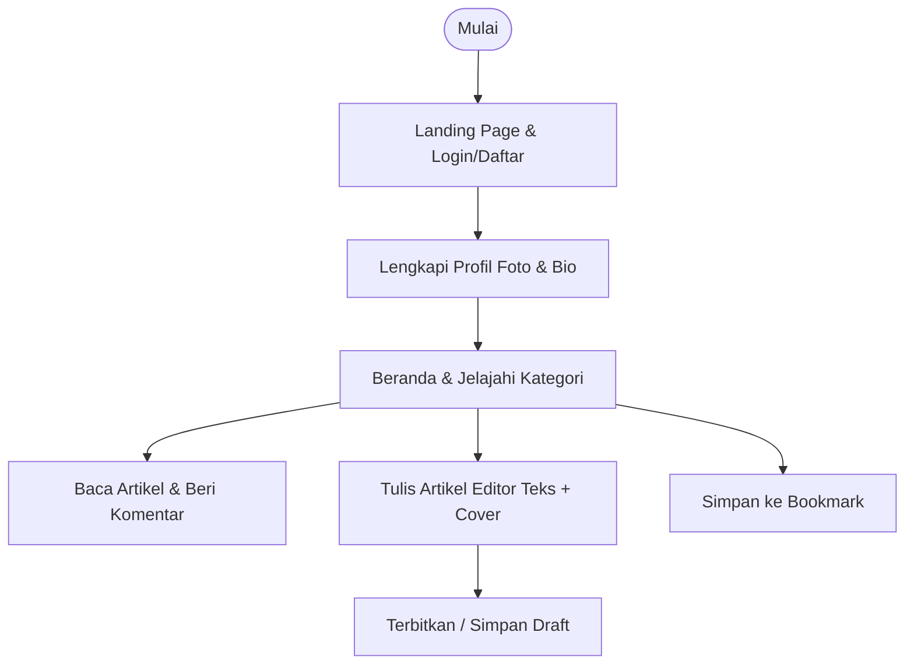

# Nulisin — Online Publishing Platform

Nulisin adalah platform penerbitan daring berbasis mobile yang dirancang untuk menyederhanakan proses penulisan dan pembacaan artikel digital secara terstruktur. Aplikasi ini memecahkan kompleksitas teknis blogging konvensional dengan menghadirkan antarmuka editorial minimalis, kenyamanan membaca yang optimal, dan sinkronisasi konten secara real-time.

---

## 👥 Pemilik Proyek (Project Owners)
Proyek ini dikembangkan oleh kelompok mahasiswa **Pemrograman Mobile — ITG 2026**:

| Nama Lengkap | NIM |
|---|---|
| **Vidya Tiara Eka Putri** | 2306005 |
| **Bambang Surya Prana** | 2306013 |
| **Naufal Kalam Marudi** | 2306021 |

---

## 🛠️ Tech Stack & Dependensi

*   **Frontend Framework**: Flutter & Dart (SDK `^3.11.1`) dengan Native State Management (`ValueNotifier`).
*   **Backend (BaaS)**: Supabase Cloud (Autentikasi, PostgreSQL Database, Realtime Sync, & File Storage).
*   **Paket Dependensi**: `supabase_flutter`, `go_router`, `flutter_quill` (Rich Text Editor), `cached_network_image`, `flutter_markdown_plus`, `shared_preferences`, `connectivity_plus`.

---

## ✨ Halaman & Fitur Utama

### 📱 5 Halaman Utama (Navigation Tabs)
1.  **Beranda (Home)**: Berfungsi menampilkan artikel yang relevan secara personal. Ketika Anda membaca artikel dari halaman Jelajahi, artikel tersebut otomatis terekam dan akan muncul di bagian atas halaman Beranda sebagai riwayat bacaan untuk memudahkan akses membaca kembali.
2.  **Jelajahi (Explore)**: Tempat menelusuri seluruh artikel publik secara global. Artikel diurutkan berdasarkan tingkat kepopuleran (jumlah klik pembaca) dan tanggal publikasi terbaru, lengkap dengan penyaringan kategori/topik yang interaktif.
3.  **Tulis (Write)**: Halaman editor artikel mandiri yang didukung oleh *Rich Text Editor* (untuk teks tebal, miring, kutipan, dll.), pengisian judul, pengunggahan gambar sampul (*cover*), pemilihan kategori, dan opsi penyimpanan sebagai Draft atau publikasi langsung (Publish).
4.  **Simpan (Bookmark)**: Berisi koleksi artikel favorit yang telah Anda tandai. Halaman ini memudahkan Anda mencari dan membaca kembali artikel-artikel pilihan yang dikelompokkan berdasarkan kategori.
5.  **Profil (Profile)**: Menampilkan biodata penulis (foto, nama, profesi, bio) beserta pembagian tab **Stories** (koleksi artikel yang dipublikasikan ke publik) dan tab **Drafts** (koleksi draf tulisan pribadi yang masih bisa disunting).

### 🛠️ Fitur Pendukung
*   **Autentikasi Akun**: Sistem registrasi & login aman berbasis email dan kata sandi menggunakan Supabase Auth.
*   **Kolom Diskusi (Komentar)**: Kolom tanggapan kronologis di bawah artikel yang membatasi pengiriman komentar hanya untuk pengguna yang telah login.
*   **Sinkronisasi Realtime**: Pembaruan feed artikel secara langsung tanpa perlu memuat ulang halaman (*silent update*).

---

## 📱 Uji Coba Produk Akhir (Instan)

Jika Anda hanya ingin langsung mencoba/menguji produk akhir tanpa melakukan setup kode sumber dan database, silakan unduh dan pasang berkas APK Nulisin melalui tautan berikut:
👉 **[Download APK Nulisin (Google Drive)](https://drive.google.com/drive/folders/1HvIAk08j3AZBUZd1qG7U7OrTtMRwC0K4?usp=sharing)**

---

## ⚙️ Cara Menjalankan Proyek Secara Lokal (Development)

Untuk menjalankan proyek ini dari kode sumber secara lokal, Anda perlu menyiapkan backend dan database sendiri menggunakan Supabase (BaaS).

### 1. Prasyarat
Pastikan perangkat Anda telah terpasang:
*   Flutter SDK (>= 3.11.1) & Dart SDK
*   Android Studio / VS Code beserta extension Flutter & Dart
*   Emulator Android atau Google Chrome (untuk Web)
*   Akun aktif di [Supabase](https://supabase.com)

### 2. Langkah Instalasi & Setup

#### Langkah A: Clone & Ambil Dependensi
```bash
git clone https://github.com/wonhee9/Nulisin.git
cd "Aplikasi Nulisin"
flutter pub get
```

#### Langkah B: Setup Database Supabase
1.  Buat proyek baru di dashboard **[Supabase](https://supabase.com)**.
2.  Buka menu **SQL Editor**, salin dan jalankan query database yang ada di berkas **[supabase_migration.sql](https://github.com/wonhee9/Nulisin/blob/main/supabase_migration.sql)**.
3.  Buat dua bucket dengan akses **Public** pada menu **Storage**: `avatars` dan `article-covers`.
4.  Matikan opsi **Confirm email** pada menu **Authentication** -> **Providers** -> **Email** agar pendaftaran akun dapat langsung dicoba tanpa verifikasi email.

#### Langkah C: Konfigurasi Kredensial di Kode Sumber
1.  Salin **Project URL** dan **anon public API Key** dari menu **Settings → API** di dashboard Supabase Anda.
2.  Buka berkas `lib/core/supabase_service.dart` di proyek lokal Anda, lalu ganti nilai variabel berikut:
    ```dart
    static const String supabaseUrl = 'URL_SUPABASE_ANDA';
    static const String supabaseAnonKey = 'ANON_KEY_SUPABASE_ANDA';
    ```

#### Langkah D: Jalankan Proyek
Jalankan perintah berikut di terminal Anda:
```bash
# Jalankan di Google Chrome (Web)
flutter run -d chrome

# Jalankan di Emulator / Perangkat Android
flutter run
```

---

## 📖 Cara Penggunaan (Alur Kerja)

